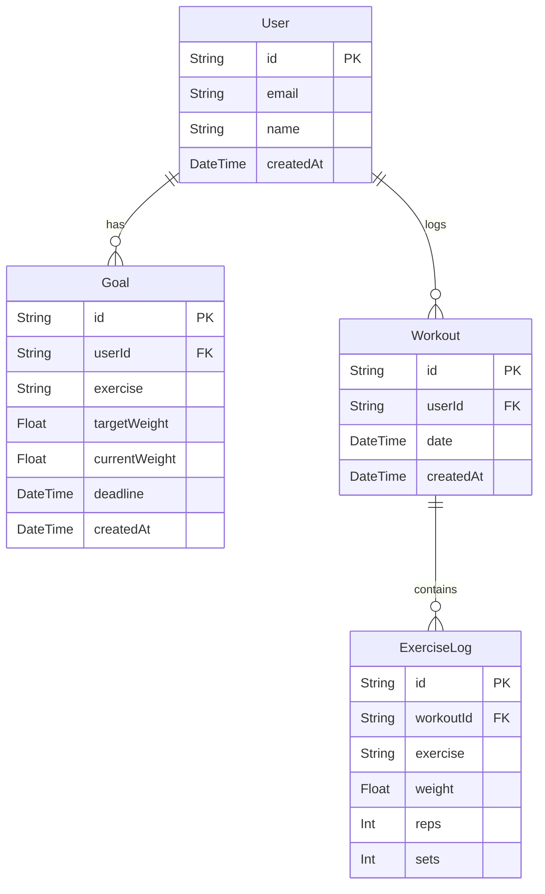
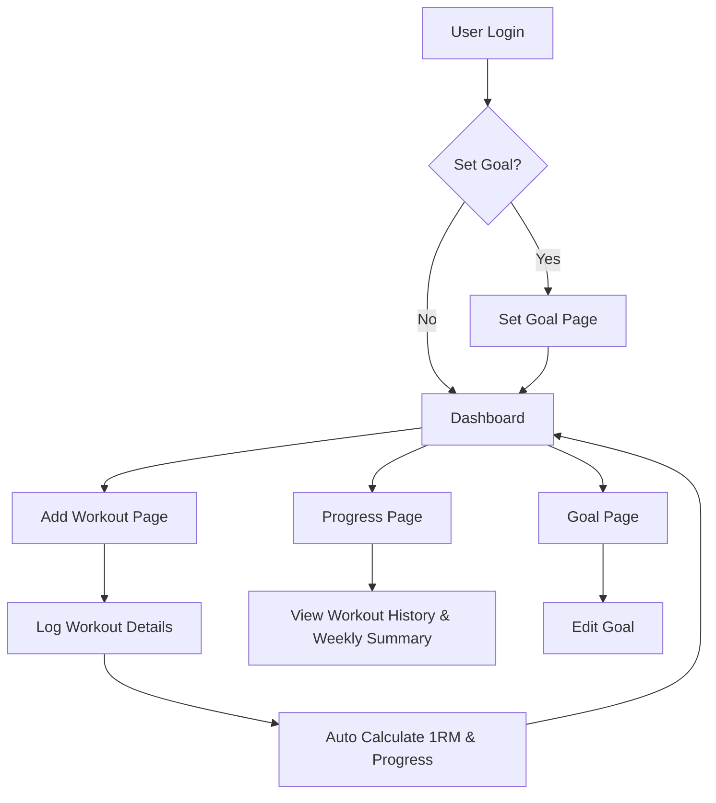
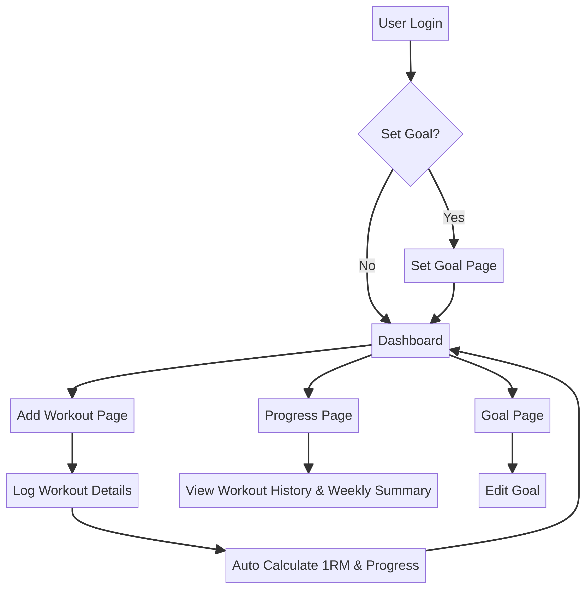
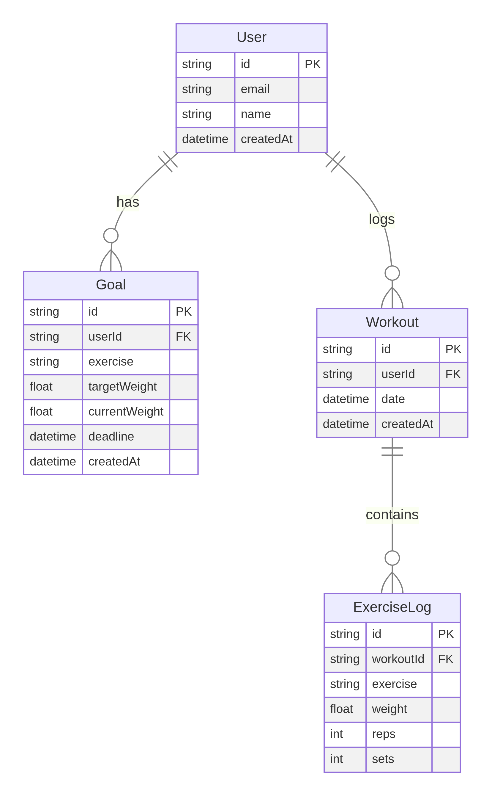

# Product Requirements Document (PRD): Gym Progress Tracker (MVP)

## 1. Executive Summary

### Problem Statement
Pengguna gym sering kesulitan melacak dan memonitor progres latihan kekuatan mereka secara efektif, sehingga menyulitkan mereka untuk mencapai target kekuatan spesifik (misalnya, Bench Press 100kg) dan mempertahankan motivasi.

### Proposed Solution
Sebuah aplikasi mobile-first yang berorientasi pada tujuan, dirancang untuk membantu pengguna melacak latihan, memonitor progres 1RM (One-Rep Max) secara otomatis, dan menampilkan ringkasan mingguan untuk mencapai target kekuatan yang telah ditetapkan.

### Success Criteria
- **Peningkatan Motivasi**: Pengguna melaporkan peningkatan motivasi untuk mencapai target kekuatan mereka setelah menggunakan aplikasi.
- **Akurasi Tracking**: Perhitungan 1RM dan progres mingguan akurat sesuai dengan data input pengguna.
- **Kemudahan Penggunaan**: Pengguna dapat dengan mudah mencatat latihan dan melihat progres mereka dengan antarmuka yang intuitif dan mobile-friendly.
- **Pencapaian Target**: Persentase pengguna yang mencapai target kekuatan mereka meningkat dalam periode waktu tertentu.

## 2. User Experience & Functionality

### User Personas
- **Pengguna Gym Pemula/Menengah**: Individu yang rutin berolahraga di gym (sekitar 3x seminggu) dan memiliki target kekuatan spesifik yang ingin dicapai (misalnya, Bench Press 100kg). Mereka membutuhkan cara yang mudah untuk mencatat latihan dan melihat progres.

### User Stories
- **Authentication**
  - Sebagai pengguna, saya ingin dapat mendaftar dan masuk ke aplikasi dengan aman menggunakan email/password atau akun Google agar saya dapat mengakses data latihan pribadi saya.
  - Sebagai pengguna, saya ingin sesi login saya tetap aktif agar saya tidak perlu login berulang kali.
- **Goal Setting**
  - Sebagai pengguna, saya ingin dapat membuat satu target kekuatan aktif (misalnya, Bench Press 100kg) agar saya memiliki tujuan yang jelas.
  - Sebagai pengguna, saya ingin dapat melihat target kekuatan saya saat ini, berat target, berat saat ini, dan batas waktu (opsional) untuk tetap fokus pada tujuan saya.
- **Workout Logging**
  - Sebagai pengguna, saya ingin dapat mencatat detail setiap set latihan saya (tanggal, jenis latihan, berat, repetisi, set) dengan cepat dan mudah di perangkat seluler.
  - Sebagai pengguna, saya ingin dapat menginput beberapa jenis latihan dalam satu sesi latihan (misalnya, Bench Press, Incline Press, Tricep Dips) agar catatan latihan saya lengkap.
- **Progress Tracking (Auto Calculation)**
  - Sebagai pengguna, saya ingin aplikasi secara otomatis menghitung estimasi 1RM saya setelah setiap input latihan agar saya dapat melihat kapasitas kekuatan saya.
  - Sebagai pengguna, saya ingin melihat progres saya menuju target kekuatan berdasarkan estimasi 1RM saya.
- **Weekly Monitoring**
  - Sebagai pengguna, saya ingin melihat ringkasan latihan saya yang dikelompokkan per minggu.
  - Sebagai pengguna, saya ingin melihat 1RM tertinggi saya untuk setiap latihan di minggu tersebut dan perubahannya dari minggu sebelumnya.

### Acceptance Criteria
- **Authentication**
  - Pengguna dapat mendaftar dan login menggunakan email/password atau akun Google.
  - Sesi pengguna dipertahankan menggunakan Auth.js.
- **Goal Setting**
  - Pengguna dapat membuat dan mengedit satu goal aktif yang mencakup Exercise, Target Weight (kg), Current Weight (kg), dan Deadline (opsional).
  - Goal yang dibuat tersimpan di database dan dapat ditampilkan di Dashboard.
- **Workout Logging**
  - Form input latihan yang mobile-friendly (tap-friendly) tersedia di halaman "Add Workout".
  - Pengguna dapat memilih jenis latihan dari dropdown atau input, serta memasukkan Weight, Reps, dan Sets.
  - Sistem dapat menyimpan beberapa `ExerciseLog` yang terkait dengan satu `Workout`.
- **Progress Tracking**
  - Estimasi 1RM dihitung secara otomatis menggunakan rumus Epley: `1RM = weight * (1 + reps / 30)` untuk setiap set yang dicatat.
  - Progres ke target dihitung sebagai `(current1RM / targetWeight) * 100`.
- **Weekly Monitoring**
  - Latihan dikelompokkan berdasarkan minggu kalender.
  - Untuk setiap latihan, 1RM tertinggi dalam seminggu ditampilkan.
  - Perubahan 1RM tertinggi dari minggu sebelumnya dihitung dan ditampilkan.

### Non-Goals
- Fitur AI (misalnya, rekomendasi latihan, analisis bentuk).
- Pelacakan nutrisi.
- Generator program latihan.
- Gamifikasi (misalnya, lencana, papan peringkat).
- Dukungan untuk beberapa goal aktif secara bersamaan (untuk MVP).

## 3. AI System Requirements (Not Applicable for MVP)

## 4. Technical Specifications

### Tech Stack
- **Frontend**: Next.js 15 (App Router)
- **Styling**: Tailwind CSS + shadcn/ui
- **Database**: PostgreSQL via Neon
- **ORM**: Prisma
- **Authentication**: Auth.js (dengan dukungan Google Provider)

### Database Design (Prisma Ready)

### Core Logic
- **Hitung 1RM**: `1RM = weight * (1 + reps / 30)`
- **Progress ke Goal**: `progress = (current1RM / targetWeight) * 100`
- **Weekly Change**: `delta = currentWeekPeak1RM - lastWeekPeak1RM` (menggunakan 1RM tertinggi per latihan per minggu)

## 5. Risks & Roadmap

### Phased Rollout (MVP)
- **MVP**: Fokus pada fitur inti: Autentikasi, Pengaturan Goal (1 aktif), Pencatatan Latihan, Perhitungan 1RM, dan Ringkasan Mingguan.

### Technical Risks
- **Skalabilitas Database**: Potensi masalah performa jika jumlah data latihan sangat besar (perlu optimasi query Prisma).
- **Akurasi 1RM**: Rumus Epley adalah estimasi; mungkin tidak 100% akurat untuk semua pengguna atau jenis latihan. Perlu komunikasi yang jelas kepada pengguna.
- **Kompleksitas UI/UX Mobile**: Memastikan pengalaman input yang cepat dan mudah di perangkat seluler membutuhkan perhatian detail dalam desain.

## 6. UI Guidelines

### Mobile First Rules
- **Bottom Navigation**: 3-4 menu utama.
- **Button Besar**: Mudah dijangkau dengan jempol.
- **Minimal Typing**: Fokus pada input cepat, mungkin dengan dropdown atau slider.

### Style Direction
- **Clean**: Mirip aplikasi fitness modern.
- **Dark Mode**: Direkomendasikan.
- **Warna**: Hitam/abu dengan aksen hijau/biru untuk indikator progres.

## 7. User Flow (Diagram)

